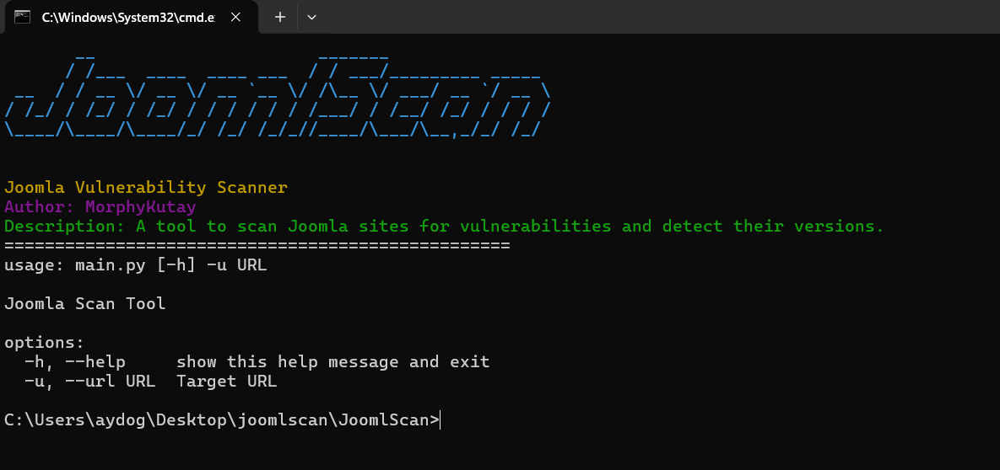

# JoomlScan

JoomlScan is a security scanning tool developed to scan Joomla-based websites and detect vulnerabilities.

## 🚀 Features

- Joomla version detection
- Admin panel discovery
- CVE database vulnerability scanning
- Colorful and user-friendly interface
- Multiple version detection methods

## 📋 Requirements

- Python 3.x
- requests>=2.31.0
- beautifulsoup4>=4.12.2
- colorama>=0.4.6
- pyfiglet>=0.8.post1

## 🛠️ Installation

1. Clone the project:
```bash
git clone https://github.com/yourusername/joomlscan.git
cd joomlscan
```

2. Install required packages:
```bash
pip install -r requirements.txt
```

## 💻 Usage

Basic usage:
```bash
python main.py -u http://example.com
```

### Parameters

- `-u, --url`: Target URL (required)

## 🔍 Feature Details

### Version Detection
- Detection via X-Meta-Generator
- Detection via XML files
- Detection via system files
- Detection via README.txt

### Admin Panel Discovery
Checks the following paths:
- /administrator/
- /admin/
- /joomla/administrator/
- /joomla/admin/
- /wp-admin/
- /wp-login.php
- /administrator/index.php
- /admin/index.php

### CVE Scanning
- Automatic scanning in MITRE CVE database
- Listing of version-specific vulnerabilities

## ⚠️ Warning

This tool is for educational purposes only and should only be used on systems you have permission to test. Unauthorized use may lead to legal issues.

## 👨‍💻 Developer

- MorphyKutay


ties.

## 📸 Screenshots




## 📝 License

This project is licensed under the GNU General Public License v3.0.  
See the [LICENSE](LICENSE) file for details.